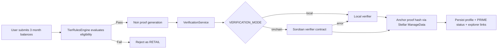

# BuildVestZK

BuildVestZK is a ZK-powered investor eligibility verification system for the BuildVest platform.

## Status

All core features are complete and merged ✅

1. ✅ Noir ZK circuit for eligibility proof generation
2. ✅ Stellar ManageData anchoring of proof hash
3. ✅ Soroban verifier contract deployed on Stellar testnet  
   `CA4YMOKFTLL53SHLND6YVLLKTO6XEYHLTPZF4SZLQX6YINMFF7LSQBLU`
4. ✅ Verification mode toggle (`local` / `onchain`) with fallback
5. ✅ `symbol_short!("verified")` fix in verifier contract
6. ✅ Demo/reset scripts (`demo`, `demo:reset`, `demo:full`)
7. ✅ BuildVest-branded frontend (landing + dashboard)

## Tech Stack

- **ZK:** Noir + Barretenberg
- **Blockchain:** Stellar testnet (ManageData) + Soroban verifier contract
- **Backend:** NestJS + TypeScript + Prisma + SQLite + JWT
- **Frontend:** React + Vite + Tailwind CSS

## Brand Assets

- **Logo:** `https://buildvest.net/buildvest-logo.png`
- **Primary Blue:** `#017EFE`
- **Primary Green:** `#03A504`

## Architecture Flow



## Deployed Contract & Explorer Links

- **Soroban Contract (testnet):**  
  `CA4YMOKFTLL53SHLND6YVLLKTO6XEYHLTPZF4SZLQX6YINMFF7LSQBLU`
- **Contract page (Stellar Lab):**  
  https://lab.stellar.org/r/testnet/contract/CA4YMOKFTLL53SHLND6YVLLKTO6XEYHLTPZF4SZLQX6YINMFF7LSQBLU
- **Deploy tx (Explorer):**  
  https://stellar.expert/explorer/testnet/tx/4e33bf5ac21cc0d2aaae729159f5008b35a0226bed2be7624aedaac6a48bda0a
- **WASM upload tx (Explorer):**  
  https://stellar.expert/explorer/testnet/tx/4e90cefa88601c396f04d46a26a345885c0b24e2473e3e3a80315f95a35aa00c

## Getting Started

### 1) Backend

```bash
cd backend
npm install
cp .env.example .env
npm run start:dev
```

Backend: `http://localhost:3000`

### 2) Frontend

```bash
cd frontend
npm install
npm run dev
```

Frontend: `http://localhost:5173`

### 3) Soroban verifier contract (optional local build/deploy)

```bash
export STELLAR_SECRET_KEY="S..."
./scripts/deploy-verifier.sh
```

## Demo Commands

Run with backend active:

```bash
cd backend
npm run demo:full
```

Also available:

- `npm run demo` — run pass/fail demo flow
- `npm run demo:reset` — reset local demo database

## Environment Variables

From `backend/.env.example`:

- `DATABASE_URL` — Prisma database URL
- `JWT_SECRET` — JWT signing secret
- `STELLAR_SECRET_KEY` — Stellar account secret (`S...`)
- `STELLAR_NETWORK` — `testnet` or `public`
- `STELLAR_HORIZON_URL` — Horizon endpoint
- `SOROBAN_RPC_URL` — Soroban RPC endpoint
- `SOROBAN_VERIFIER_CONTRACT_ID` — deployed verifier contract ID
- `VERIFICATION_MODE` — `local` or `onchain` (with local fallback)
- `FRONTEND_URL` — allowed frontend origin
- `PORT` — backend port

## API Endpoints

No `/api/v1` prefix:

- `POST /auth/signup`
- `POST /auth/login`
- `GET /eligibility/status`
- `POST /eligibility/evaluate`

## Project Structure

```text
BuildVestZK/
├── backend/                 # NestJS API + proof orchestration
├── frontend/                # React/Tailwind BuildVest UI
├── contracts/verifier/      # Soroban verifier contract
├── circuits/balance_check/  # Noir ZK circuit
├── scripts/
│   ├── demo.ts
│   ├── reset.ts
│   └── deploy-verifier.sh
└── docs/
    ├── execution_plan.md
    ├── DEPLOYMENT.md
    └── backend_testing.md
```

## Documentation

- Execution plan/status: [`docs/execution_plan.md`](docs/execution_plan.md)
- Deployment: [`docs/DEPLOYMENT.md`](docs/DEPLOYMENT.md)
- Backend testing: [`docs/backend_testing.md`](docs/backend_testing.md)
