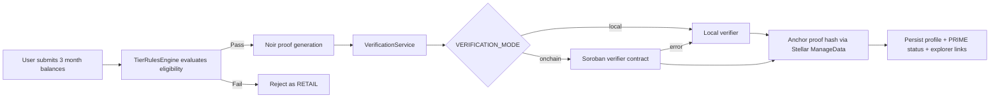

# BuildVestZK

BuildVestZK is a ZK-powered investor eligibility verification system for the BuildVest platform.

## Status

All core features are complete and merged ✅

1. ✅ Real Noir ZK circuit proof generation is working by default (mock proof remains as fallback only)
2. ✅ Stellar ManageData anchoring of proof hash
3. ✅ Soroban verifier contract deployed on Stellar testnet  
   `CA4YMOKFTLL53SHLND6YVLLKTO6XEYHLTPZF4SZLQX6YINMFF7LSQBLU`
4. ✅ Verification mode toggle (`local` / `onchain`) with fallback
5. ✅ `symbol_short!("verified")` fix in verifier contract
6. ✅ Demo/reset scripts (`demo`, `demo:reset`, `demo:full`)
7. ✅ BuildVest-branded frontend (landing + dashboard)
8. ✅ Deterministic sample PDF demo flow (known PDFs auto-populate balances, unknown PDFs allow manual entry)
9. ✅ Eligibility page redesign (light background, BuildVest branding, blue actions, green upload success state)

## Tech Stack

- **ZK:** Noir + Barretenberg (real proof flow enabled by default)
- **Blockchain:** Stellar testnet (ManageData) + Soroban verifier contract
- **Backend:** NestJS + TypeScript + Prisma + SQLite + JWT
- **Frontend:** React + Vite + Tailwind CSS

### ZK version alignment (working)

| Component | Version | Status |
|-----------|---------|--------|
| nargo | 0.36.0 | ✅ Compiles circuit |
| @noir-lang/noir_js | 0.36.0 | ✅ Executes witness |
| @noir-lang/backend_barretenberg | 0.36.0 | ✅ Generates & verifies proof |
| Soroban contract | CA4YMOKFTLL53SHLND6YVLLKTO6XEYHLTPZF4SZLQX6YINMFF7LSQBLU | ✅ On-chain verification |
| Stellar network | Testnet | ✅ Proof hash anchored |

## Brand Assets

- **Logo:** `https://buildvest.net/buildvest-logo.png`
- **Primary Blue:** `#017EFE`
- **Primary Green:** `#03A504`

## Architecture Flow


```mermaid
flowchart LR
  A[User submits 3 month balances] --> B[TierRulesEngine evaluates eligibility]
  B -->|Pass| C[Noir proof generation]
  B -->|Fail| X[Reject as RETAIL]
  C --> D[VerificationService]
  D --> E{VERIFICATION_MODE}
  E -->|local| F[Local verifier]
  E -->|onchain| G[Soroban verifier contract]
  G -->|error| F
  F --> H[Anchor proof hash via Stellar ManageData]
  G --> H
  H --> I[Persist profile + PRIME status + explorer links]
```

## Verified Real Proof Pipeline

```text
Real Noir circuit proof (nargo 0.36.0) → SHA-256 proof hash → Stellar ManageData tx → Soroban on-chain verification ✅
```

## Sample PDF Demo Flow

Known sample PDFs in `frontend/public/samples/`:

| File | Balances | Result |
|------|----------|--------|
| `statement_pass_high.pdf` | `[2500, 3100, 1800]` | ✅ All > $1,000 → PRIME upgrade |
| `statement_pass_borderline.pdf` | `[1050, 1200, 1001]` | ✅ Barely passes → PRIME upgrade |
| `statement_fail.pdf` | `[1500, 800, 2200]` | ❌ Month 2 < $1,000 → Rejected |

Behavior:
- PDF upload is required (Evaluate button remains disabled until upload)
- Known PDF → balances auto-populate as read-only inputs
- Unknown PDF → warning shown + editable balances for manual test input
- Pass → Noir proof + Soroban verification + PRIME upgrade
- Fail → `Does not qualify. All 3 monthly balances must exceed $1,000.` + `Return to Dashboard`

## Eligibility Page Redesign

- Light background and dark text inputs
- BuildVest branding with logo/header above the upgrade card
- Blue action buttons (`Choose PDF`, `Evaluate Eligibility`)
- Green checkmark confirmation after successful PDF upload
- Sample PDFs are downloadable directly from the eligibility page

## Deployed Contract & Explorer Links

- **Soroban Contract (testnet):**  
  `CA4YMOKFTLL53SHLND6YVLLKTO6XEYHLTPZF4SZLQX6YINMFF7LSQBLU`
- **Contract page (Stellar Lab):**  
  https://lab.stellar.org/r/testnet/contract/CA4YMOKFTLL53SHLND6YVLLKTO6XEYHLTPZF4SZLQX6YINMFF7LSQBLU
- **Deploy tx (Explorer):**  
  https://stellar.expert/explorer/testnet/tx/4e33bf5ac21cc0d2aaae729159f5008b35a0226bed2be7624aedaac6a48bda0a
- **WASM upload tx (Explorer):**  
  https://stellar.expert/explorer/testnet/tx/4e90cefa88601c396f04d46a26a345885c0b24e2473e3e3a80315f95a35aa00c

## Getting Started

### 0) Noir toolchain (required for real proof generation)

Use matching 0.36.0 versions:

```bash
# nargo (Noir CLI)
noirup -v 0.36.0
nargo --version

# backend npm packages
cd backend
npm install
npm ls @noir-lang/noir_js @noir-lang/backend_barretenberg

# compile Noir circuit artifact
cd ../circuits/balance_check
nargo compile
```

Circuit entrypoint syntax for `nargo 0.36.0`:

```noir
fn main(balances: [Field; 3], threshold: Field) -> pub Field
```

### 1) Backend

```bash
cd backend
npm install
cp .env.example .env
npm run start:dev
```

Backend: `http://localhost:3000`

### 2) Frontend

```bash
cd frontend
npm install
npm run dev
```

Frontend: `http://localhost:5173`

### 3) Soroban verifier contract (optional local build/deploy)

```bash
export STELLAR_SECRET_KEY="S..."
./scripts/deploy-verifier.sh
```

## Demo Commands

Run with backend active:

```bash
cd backend
npm run demo:full
```

Also available:

- `npm run demo` — run pass/fail demo flow
- `npm run demo:reset` — reset local demo database

## Environment Variables

From `backend/.env.example`:

- `DATABASE_URL` — Prisma database URL
- `JWT_SECRET` — JWT signing secret
- `STELLAR_SECRET_KEY` — Stellar account secret (`S...`)
- `STELLAR_NETWORK` — `testnet` or `public`
- `STELLAR_HORIZON_URL` — Horizon endpoint
- `SOROBAN_RPC_URL` — Soroban RPC endpoint
- `SOROBAN_VERIFIER_CONTRACT_ID` — deployed verifier contract ID
- `VERIFICATION_MODE` — `local` or `onchain` (with local fallback)
- `FRONTEND_URL` — allowed frontend origin
- `PORT` — backend port

## API Endpoints

No `/api/v1` prefix:

- `POST /auth/signup`
- `POST /auth/login`
- `GET /api/health` (public healthcheck endpoint, no auth)
- `GET /eligibility/status`
- `POST /eligibility/evaluate`

For Railway (or any deployer), set the healthcheck path to:

- `/api/health` ✅

Do **not** use `/eligibility/status` as a healthcheck path because it requires JWT auth.

When proofs succeed end-to-end with Soroban verification, API responses show:

```json
{
  "tier": "PRIME",
  "status": "APPROVED",
  "qualified": true,
  "proofHash": "9bc46abc7bc1ac6304cfe6774cf5507e268587aa76fb38fc13040946981bf86b",
  "stellarTxHash": "51a1e26161837ba375c07226897f84d81c087d36b280d78e044b7239b8366636",
  "stellarLedger": 2121931,
  "sorobanTxHash": "3d3f6a91be5cfb84fff16c123723c8c4198b164a5e2149f70a61360891c03132",
  "verificationMethod": "onchain",
  "verifiedAt": "2026-04-19T16:06:20.934Z"
}
```

## Testing: Sample PDF Flow + Real Noir Verification

1. Start backend and frontend from this repository:
   - Backend: `cd backend && npm install && cp .env.example .env && npm run start:dev`
   - Frontend: `cd frontend && npm install && npm run dev`
2. Open the eligibility page (`/eligibility` or `/upgrade`).
3. Upload each sample PDF and validate:
   - `statement_pass_high.pdf` → read-only `[2500,3100,1800]` → pass
   - `statement_pass_borderline.pdf` → read-only `[1050,1200,1001]` → pass
   - `statement_fail.pdf` → read-only `[1500,800,2200]` → fail message
4. Upload an unknown PDF and verify warning + editable manual input fields.
5. After a pass case, verify real on-chain proof status:

```bash
curl http://localhost:3000/eligibility/status \
  -H "Authorization: Bearer <TOKEN>"
```

Check for:
- `"verificationMethod": "onchain"`
- `proofHash`, `stellarTxHash`, `sorobanTxHash`, and `verifiedAt` present

## Project Structure

```text
BuildVestZK/
├── backend/                 # NestJS API + proof orchestration
├── frontend/                # React/Tailwind BuildVest UI
├── contracts/verifier/      # Soroban verifier contract
├── circuits/balance_check/  # Noir ZK circuit
├── scripts/
│   ├── demo.ts
│   ├── reset.ts
│   └── deploy-verifier.sh
└── docs/
    ├── execution_plan.md
    ├── DEPLOYMENT.md
    └── backend_testing.md
```

## Documentation

- Execution plan/status: [`docs/execution_plan.md`](docs/execution_plan.md)
- Deployment: [`docs/DEPLOYMENT.md`](docs/DEPLOYMENT.md)
- Backend testing: [`docs/backend_testing.md`](docs/backend_testing.md)
