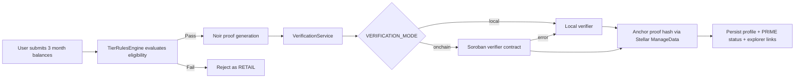

# 🚀 BuildVestZK

**BuildVestZK** is a ZK-powered investor eligibility verification system for the BuildVest platform.

It enables **privacy-first investor qualification** — proving that users meet financial requirements **without exposing sensitive data**.

🔗 Live App: https://build-vest-zk.vercel.app/  
📄 Pitch Deck: https://github.com/silasneo/BuildVestZK/blob/main/docs/BuildVest_Privacy-First_Fractional_RealAssets-Deck.pdf  

---

## 🌍 BuildVest Background

BuildVest is a fractional investment platform enabling people to invest in **well-titled, income-producing real-world assets** across emerging markets — starting from **$100 (₦150k)**.

High-yield assets exist globally, especially in emerging markets, but remain largely inaccessible due to:

- High minimums  
- Low trust  
- Weak governance  
- Limited access for global & diaspora investors  

This creates a paradox:

> **Trillions in assets. Billions in demand. Almost no trusted rails.**

### The Missing Layer

Tokenization alone is not enough.

The real bottleneck is:

> **How do you verify investors without exposing their private financial data?**

Traditional KYC exposes sensitive information.  
BuildVestZK introduces a **privacy-preserving trust layer**.

---

## 🔐 What BuildVestZK Does

BuildVestZK uses **Zero-Knowledge Proofs (ZK)** to allow users to:

- ✅ Prove eligibility  
- ❌ Without revealing underlying financial data  

### 🧠 Non-Technical Intuition

> “I can prove I meet the requirement — without showing you my actual numbers.”

Example rule (used in this demo):

- Maintain **balance > $1,000 for 3 months**

The system verifies this condition **without ever seeing the balances themselves**.

---

## ⚙️ Status

All core features are complete and merged ✅

1. ✅ Real Noir ZK circuit proof generation (default)
2. ✅ Stellar ManageData anchoring of proof hash
3. ✅ Soroban verifier contract deployed on Stellar testnet  
   `CA4YMOKFTLL53SHLND6YVLLKTO6XEYHLTPZF4SZLQX6YINMFF7LSQBLU`
4. ✅ Verification mode toggle (`local` / `onchain`)
5. ✅ Local fallback logic
6. ✅ Demo/reset scripts
7. ✅ BuildVest-branded frontend
8. ✅ Deterministic PDF demo flow
9. ✅ Eligibility UX redesign

---

## 🏗️ Tech Stack

- **ZK:** Noir + Barretenberg  
- **Blockchain:** Stellar (ManageData + Soroban contract)  
- **Backend:** NestJS + TypeScript + Prisma + SQLite + JWT  
- **Frontend:** React + Vite + Tailwind CSS  

---

## 🔁 Architecture Flow


```mermaid
flowchart LR
  A[User submits 3 month balances] --> B[TierRulesEngine evaluates eligibility]
  B -->|Pass| C[Noir proof generation]
  B -->|Fail| X[Reject as RETAIL]
  C --> D[VerificationService]
  D --> E{VERIFICATION_MODE}
  E -->|local| F[Local verifier]
  E -->|onchain| G[Soroban verifier contract]
  G -->|error| F
  F --> H[Anchor proof hash via Stellar ManageData]
  G --> H
  H --> I[Persist profile + PRIME status + explorer links]
```

---

## 🔗 Verified Real Proof Pipeline

```text
Real Noir circuit proof (nargo 0.36.0)
→ SHA-256 proof hash
→ Stellar ManageData transaction
→ Soroban on-chain verification
→ PRIME investor status ✅
```

---

## 🧪 Demo / Test Guide (For Judges & Investors)

### Step 1 — Open the App

👉 https://build-vest-zk.vercel.app/

---

### Step 2 — Navigate to Eligibility

Go to:
```
/eligibility or /upgrade
```

---

### Step 3 — Upload Sample PDF

Use provided demo files:

| File | Result |
|------|--------|
| `statement_pass_high.pdf` | ✅ PRIME |
| `statement_pass_borderline.pdf` | ✅ PRIME |
| `statement_fail.pdf` | ❌ RETAIL |

---

### Step 4 — Observe

- PDF upload required before evaluation  
- Known PDFs auto-fill balances  
- Unknown PDFs allow manual input  
- Pass → ZK proof + on-chain verification  
- Fail → clear rejection  

---

### Step 5 — Verify On-Chain

```bash
curl http://localhost:3000/eligibility/status   -H "Authorization: Bearer <TOKEN>"
```

Check:

- `"verificationMethod": "onchain"`
- `proofHash`
- `stellarTxHash`
- `sorobanTxHash`

---

## 🧾 Sample PDF Demo Flow

| File | Balances | Result |
|------|----------|--------|
| statement_pass_high.pdf | [2500, 3100, 1800] | ✅ PRIME |
| statement_pass_borderline.pdf | [1050, 1200, 1001] | ✅ PRIME |
| statement_fail.pdf | [1500, 800, 2200] | ❌ FAIL |

---

## 🔧 ZK Version Alignment

| Component | Version | Status |
|----------|--------|--------|
| nargo | 0.36.0 | ✅ |
| noir_js | 0.36.0 | ✅ |
| barretenberg | 0.36.0 | ✅ |
| Soroban | Testnet | ✅ |

---

## 📡 Deployed Contracts

- Contract:  
  `CA4YMOKFTLL53SHLND6YVLLKTO6XEYHLTPZF4SZLQX6YINMFF7LSQBLU`

- Explorer:  
  https://lab.stellar.org/r/testnet/contract/CA4YMOKFTLL53SHLND6YVLLKTO6XEYHLTPZF4SZLQX6YINMFF7LSQBLU

---

## 🛠️ Getting Started

### Noir

```bash
noirup -v 0.36.0
nargo compile
```

### Backend

```bash
cd backend
npm install
cp .env.example .env
npm run start:dev
```

### Frontend

```bash
cd frontend
npm install
npm run dev
```

---

## 🔌 API Endpoints

- POST /auth/signup  
- POST /auth/login  
- GET /api/health  
- GET /eligibility/status  
- POST /eligibility/evaluate  

---

## 🎯 Why This Matters

BuildVestZK enables:

- Privacy-first compliance  
- Global investor onboarding  
- Trust without exposing data  
- Scalable verification for real-world assets  

---

## 🔭 Roadmap

- ✅ ZK prototype complete  
- 🔜 Full BuildVest integration  
- 🔜 Multi-rule verification  
- 🔜 Full tokenization + privacy layer  

---

## 🌐 Vision

> Become the default platform for fractional ownership of emerging-market real assets — powered by privacy, trust, and programmable finance.

---

## 🤝 Contact

Silas Okwoche  
silas@buildvest.net  
Lagos, Nigeria | Global  
